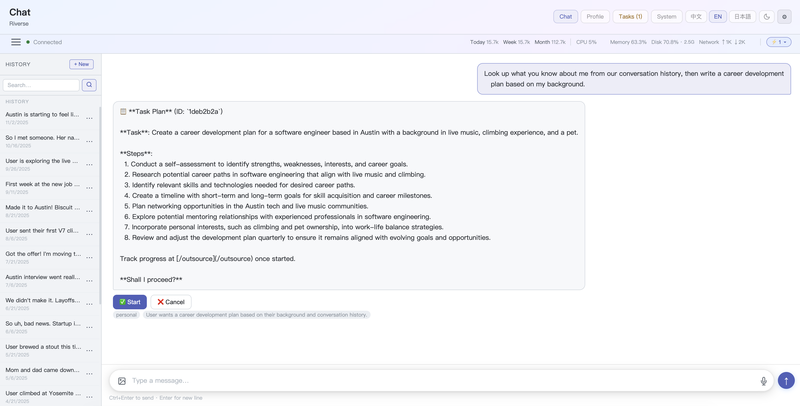
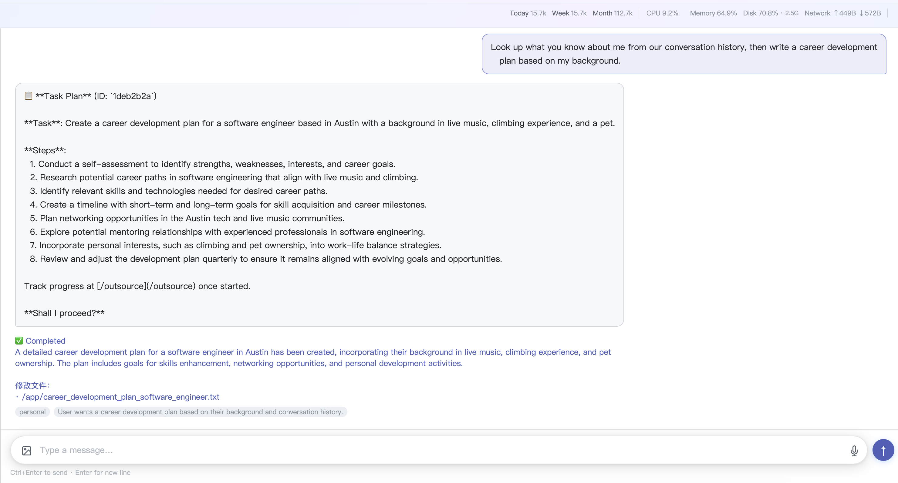
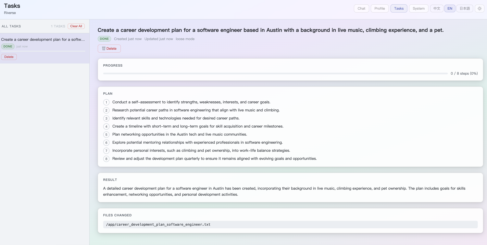

# Outsource / Task Agent

Delegate complex, multi-step tasks to an autonomous sub-agent that works in the background while you continue chatting.

## How It Works

The task agent uses a **ReAct loop** — it thinks, picks a tool, observes the result, and repeats until the task is done or an error occurs. It has access to:

- `file_read` / `file_write` / `file_list` — read and write local files
- `shell_exec` — run shell commands (whitelisted in strict mode)
- `grep` — search code and files
- `ask_user` — pause and ask you a question mid-task

## Two-Step Flow

Tasks always follow a preview → confirm → execute pattern:

**Step 1 — Preview**

Trigger the outsource skill by using any of these phrases in chat:

| Language | Trigger phrases |
|----------|----------------|
| English | `outsource mode`, `outsource this`, `delegate to agent`, `run as task`, `use task agent` |
| Chinese | `外包模式`、`外包任务`、`帮我外包`、`用外包`、`外包给你` |
| Japanese | `派遣モード`、`派遣して`、`派遣タスク`、`派遣に` |

Example:

> "Outsource: scan the project and generate a README"

The agent calls `dispatch_task` with `action=preview`, generates a step-by-step plan, and shows it to you for review.



**Step 2 — Confirm**

Reply with "yes", "start", or similar. The agent calls `dispatch_task` with `action=start` and execution begins in the background. You can continue chatting while the task runs. When done, the result appears directly in chat:



## Tracking Progress

Open `/outsource` in the web dashboard to see:

- All tasks (running, done, failed, cancelled)
- Real-time step-by-step execution log
- Tool parameters used at each step (collapsible)
- Final result and files changed

A **task tray** in the status bar shows active task count at a glance.



## Interactive Questions

If the sub-agent needs clarification mid-task, it uses the `ask_user` tool to pause and send a question to your chat. Reply inline — the agent resumes automatically.

## Strict vs. Loose Mode

| Mode | Allowed |
|------|---------|
| **Strict** (default) | Read files, search, syntax checks, tests. Package installs require your explicit approval via `ask_user`. |
| **Loose** | All of the above plus `pip install`, `npm install`, arbitrary shell commands (from whitelist). |

Configure in `settings.yaml`:

```yaml
tools:
  dispatch_task:
    enabled: true
    strict_mode: true   # set to false for loose mode
    max_steps: 20
    max_tokens: 8192
```

## Cancellation & Deletion

- **Cancel** — Stop a running task from the `/outsource` page. Status is set to `cancelled`.
- **Delete** — Soft-deleted (history preserved). Useful for debugging past task execution logs.

## Temporary Files

The sub-agent is instructed to place any temporary scripts in a per-task directory (`/tmp/jkriver_tasks/{task_id}/`). This directory is automatically cleaned up when the task finishes.
