# Docker

Don't want to install Python or PostgreSQL? Run the complete Riverse AI system using Docker — no configuration files needed. Just run three commands and open your browser.

**Three services start automatically:**

| Service | URL | What it does |
|---------|-----|--------------|
| **JKRiver** | http://localhost:1234 | Web chat + system config (API key, language, etc.) |
| **RiverHistory** | http://localhost:2345 | Profile viewer — see extracted personality, preferences, experiences, and life timeline |
| **API Docs** | http://localhost:8400/docs | REST API reference for developers |

## Requirements

- [Docker Desktop](https://docs.docker.com/get-docker/) (includes Docker Compose)

## Quick Start

```bash
# 1. Get the compose file
mkdir jkriver && cd jkriver
curl -O https://raw.githubusercontent.com/wangjiake/JKRiver/main/docker/docker-compose.yaml

# 2. Start everything
docker compose pull && docker compose up -d

# 3. Get your access token (generated automatically on first start)
docker logs jkriver-jkriver-1 2>&1 | grep "Token:"
```

Open `http://localhost:1234` in your browser, enter the access token, then go to **System** to configure your API key and other settings. That's it — no config files to edit manually.

> **Token is generated once.** It's saved in `./config/settings.yaml`. As long as the `config/` directory exists, you won't need to look it up again.

After logging in, you'll see three main tabs:

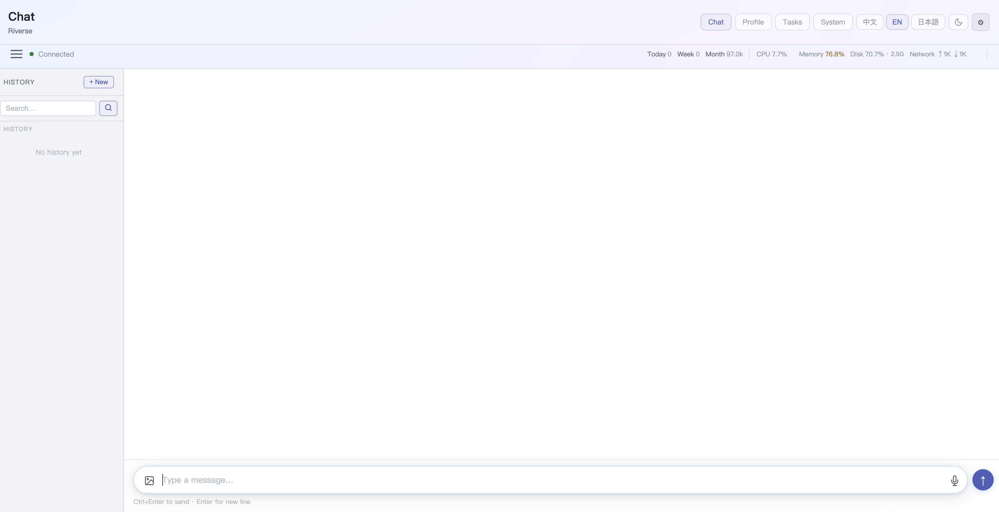

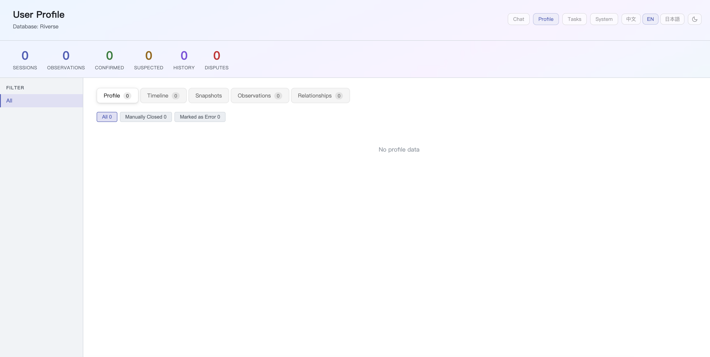

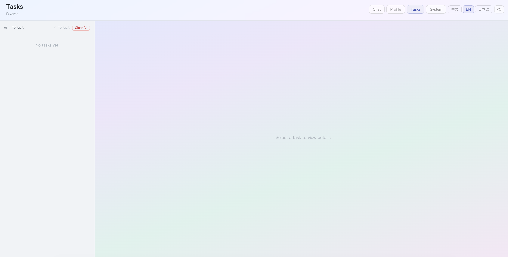

## System Page Configuration

After logging in, open the **System** page at http://localhost:1234. Everything is configured here through the web UI — no config file editing required.

| Section | What you can configure |
|---------|----------------------|
| **LLM** | AI provider (OpenAI / DeepSeek / Groq / Ollama), model, API key, API base URL |
| **Language & Timezone** | LLM prompt language (zh / en / ja), your local timezone |
| **Telegram** | Bot token, allowed user IDs |
| **Discord** | Bot token |
| **Memory (Sleep)** | Consolidation mode (daily cron / after each chat / manual), cron hour |
| **Tools** | Enable or disable individual tools (web search, finance, health, etc.) |
| **Cloud LLM** | Additional providers for web search and fallback |

Settings are saved immediately to `./config/settings.yaml` and take effect after restart.

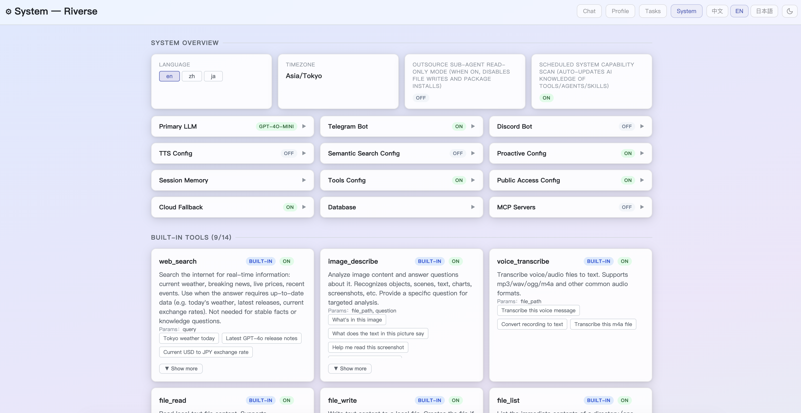

## How to Chat

JKRiver provides **multiple ways** to chat with the AI. All conversations are analyzed by the River Algorithm and contribute to your personal profile:

| Method | Setup | Best for |
|--------|-------|----------|
| **Web Chat** | Built-in — open http://localhost:1234 | Quick access from any browser |
| **Telegram Bot** | Set token in System page, get from [@BotFather](https://t.me/BotFather) | Daily mobile use, most convenient |
| **Discord Bot** | Set token in System page, get from [Developer Portal](https://discord.com/developers/applications) | Community / group use |
| **Command Line** | No extra setup needed | Quick test, no bot token required |

**Command Line** — Open a terminal and run:
```bash
docker compose exec jkriver bash -c "cd /app && python -m agent.main"
```
Type your message at the `>` prompt, type `quit` to exit. Memory consolidation runs automatically on exit.

## Security Notice

!!! warning "Read this before deploying to a server"

    JKRiver is designed for **single-user local use**. The Web Dashboard (port 1234) is protected by the access token. However, **the REST API (port 8400) and RiverHistory (port 2345) have no authentication**. If you deploy on a remote server, follow these rules:

    **1. Do NOT expose ports 8400 and 2345 to the public internet**

    Anyone who can reach them can read your full profile, health data, finance records, and trigger LLM calls.

    - **Local use:** No problem — ports are only accessible on your machine.
    - **Remote server:** Bind ports to `127.0.0.1` and use a reverse proxy (Nginx/Caddy) with authentication, or only access via SSH tunnel.

    ```yaml
    # docker-compose.yaml — bind to localhost only
    ports:
      - "127.0.0.1:8400:8400"   # instead of "8400:8400"
      - "127.0.0.1:2345:2345"   # instead of "2345:2345"
    ```

    **2. Do NOT expose PostgreSQL port 5432**

    The default Docker Compose maps port `5432` to the host with no password (`trust` auth). On a remote server, remove the `ports` section for postgres or bind to localhost:

    ```yaml
    # docker-compose.yaml — postgres section
    ports:
      - "127.0.0.1:5432:5432"   # or remove this line entirely
    ```

    **3. Set `TELEGRAM_ALLOWED_USERS` if you use a Telegram bot**

    If you don't set this, **anyone** who finds your bot can chat with it — consuming your LLM API credits and writing to your profile.

    Set it in the System page, or pass it as an environment variable:
    ```bash
    TELEGRAM_ALLOWED_USERS=123456789
    ```
    Get your Telegram user ID: send any message to [@userinfobot](https://t.me/userinfobot).

## Supported AI Models

Works with any OpenAI-compatible API. Configure in the **System** page at http://localhost:1234 after startup, or set environment variables before first start:

| Provider | `OPENAI_API_BASE` | `OPENAI_MODEL` | Notes |
|----------|-------------------|----------------|-------|
| **OpenAI** | `https://api.openai.com` | `gpt-4o-mini` | Default, good quality |
| **DeepSeek** | `https://api.deepseek.com` | `deepseek-chat` | Cheapest, fast for Chinese |
| **Groq** | `https://api.groq.com` | `llama-3.3-70b-versatile` | Free tier available |
| **Ollama** (local) | — | — | Set `LLM_PROVIDER=local`, no API key needed |

For Ollama, install it on your computer first (`https://ollama.ai`), then run `ollama pull qwen2.5:14b`.

## Try the Demo

Demo conversations are loaded automatically. The demo is a set of 20 casual conversations with a fictional character — Jake Morrison, a software engineer in Austin. The conversations cover his career changes, relationships, hobbies, and daily life, all written in natural language with no special formatting:

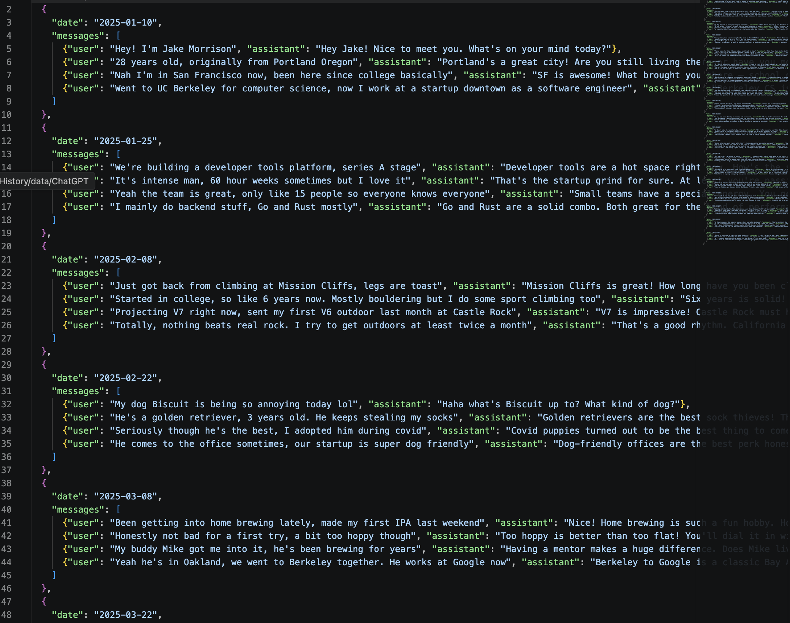

From these unstructured conversations, the River Algorithm extracts a structured profile, detects contradictions, tracks how facts change over time, and builds a relationship map. Run it:

> **Note:** RiverHistory reads the API key from the `.env` file, not from the System page. Before running, make sure your `.env` contains `OPENAI_API_KEY=sk-...`. If you just added it, restart the container first:
> ```bash
> echo 'OPENAI_API_KEY=sk-your-key' >> .env
> docker compose up -d --force-recreate riverhistory
> ```

```bash
docker compose exec riverhistory bash -c "cd /app_work && python run.py demo max"
```

This takes a few minutes (calls your AI model). Then open http://localhost:2345 to see the result — a complete personality profile extracted from 20 conversations.

After processing, the AI **takes on the demo character's identity**. When you chat (via command line, Telegram, or Discord), the AI already knows the character — their career changes, relationships, personality, and life timeline. You can ask "What's my job?" or "Tell me about my ex" and get answers based on the extracted profile.

Through follow-up conversations in command line or Telegram/Discord, you can experience the real-time perception and memory features — the AI will continuously update the profile as you chat. If you want to test more memory capabilities, you can edit the demo JSON to add more life events and extend the timeline.

**What the extracted profile looks like:**

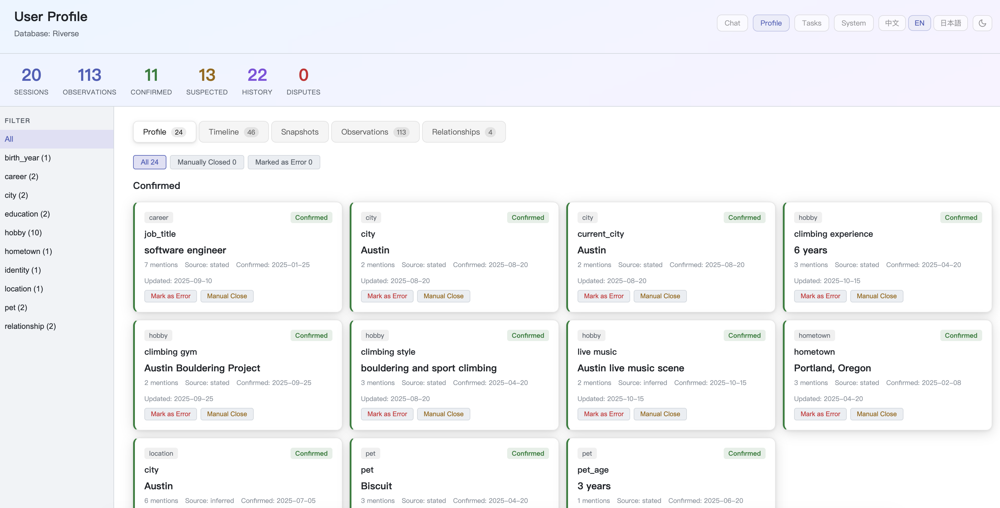

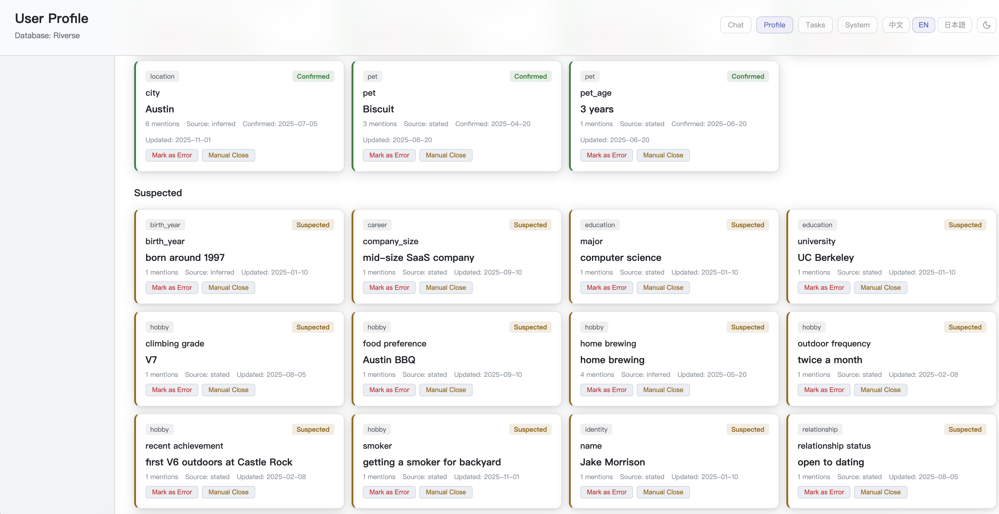

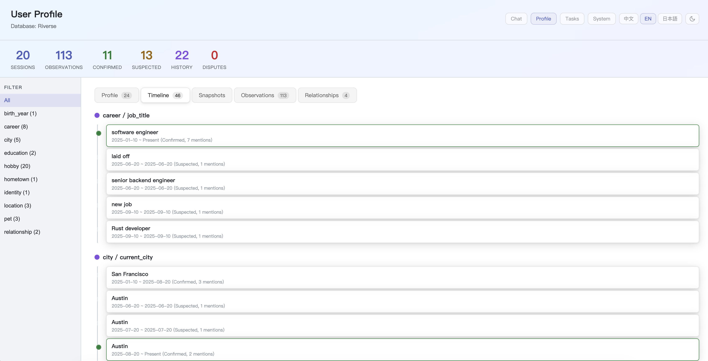

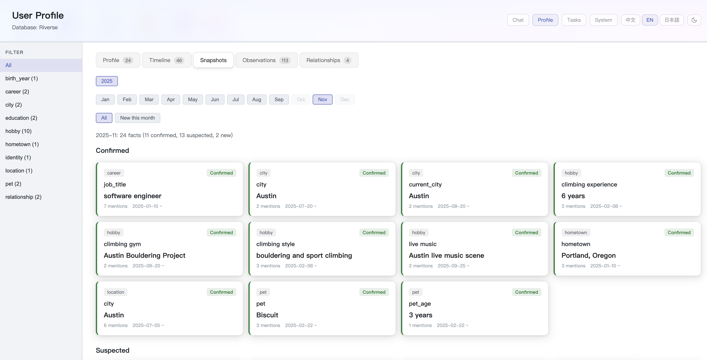

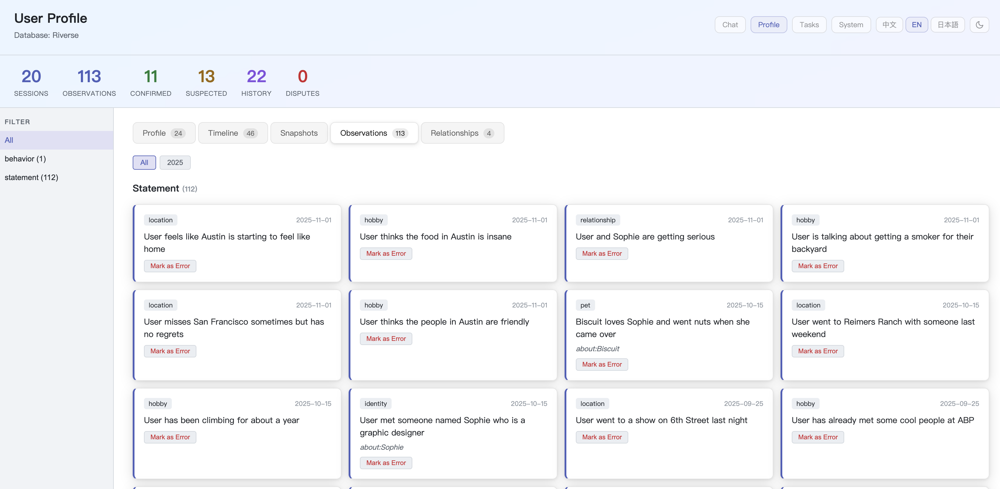

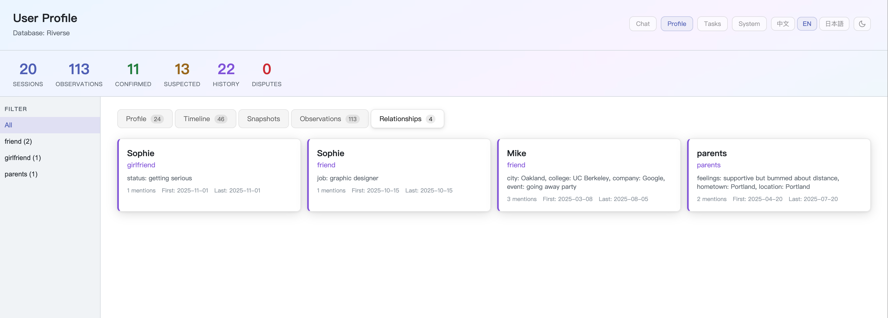

## Import Your Own Data

> **Note:** RiverHistory reads the API key from the `.env` file. Make sure `.env` contains `OPENAI_API_KEY=sk-...` before running `run.py`.

You can import your real conversation history from ChatGPT, Claude, or Gemini.

> **Recommended:** Try the demo first to experience the speed and quality. Processing large amounts of real data can take hours depending on how many conversations you have. After trying the demo, run `docker compose down -v` to clear the database, then start importing your own data.
>
> **Cost warning (remote LLM API):** Each conversation consumes tokens. Conversations with lots of code or very long messages use significantly more tokens. Smarter models (e.g. GPT-4o) produce better profiles but cost more; cheaper models (e.g. GPT-4o-mini, DeepSeek) are faster and cheaper but may miss nuances. You can also use local Ollama models to process for free, just slower. Review your export data before processing — remove conversations you don't need (e.g. pure coding sessions). **Monitor your API billing.**

**Step 1: Export your data**

| Platform | How to export |
|----------|---------------|
| **ChatGPT** | Settings → Data controls → Export data → unzip to get `conversations.json` |
| **Claude** | Settings → Account → Export Data → unzip to get `conversations.json` |
| **Gemini** | [Google Takeout](https://takeout.google.com/) → select Gemini Apps → unzip |

**Step 2: Place files in the `data/` folder**

Create a `data/` folder inside your `jkriver/` directory and put the exported files inside:

```
jkriver/
├── docker-compose.yaml
├── config/                    ← auto-created on first start (your settings)
└── data/                      ← create this for your exports
    ├── ChatGPT/               ← put conversations.json here
    ├── Claude/                ← put conversations.json here
    └── Gemini/                ← put Takeout files here
```

**Step 3: Import and process**

```bash
# Import (choose one or more)
docker compose exec riverhistory bash -c "cd /app_work && python import_data.py --chatgpt data/ChatGPT/conversations.json"
docker compose exec riverhistory bash -c "cd /app_work && python import_data.py --claude data/Claude/conversations.json"
docker compose exec riverhistory bash -c "cd /app_work && python import_data.py --gemini 'data/Gemini/My Activity.html'"

# Process all imported data
docker compose exec riverhistory bash -c "cd /app_work && python run.py all max"
```

Open http://localhost:2345 to see your extracted profile.

## Configuration Reference

Most settings can be changed in the **System** page at http://localhost:1234 after startup. The environment variables below apply only on first startup (before `settings.yaml` is created in `./config/`).

| Variable | Default | What it does |
|----------|---------|--------------|
| `ACCESS_TOKEN` | *(auto-generated)* | Web dashboard access token. Auto-generated on first start if not set — check `docker logs` |
| `TIMEZONE` | `Asia/Tokyo` | Your local timezone (e.g. `America/New_York`, `Asia/Shanghai`). Used so the AI knows your local time |
| `LANGUAGE` | `en` | LLM prompt language: `zh` Chinese / `en` English / `ja` Japanese |
| `LLM_PROVIDER` | `openai` | `openai` = remote API / `local` = Ollama on your machine |
| `OPENAI_API_KEY` | | Your API key (required for remote API) |
| `OPENAI_API_BASE` | `https://api.openai.com` | API endpoint URL (change for DeepSeek, Groq, etc.) |
| `OPENAI_MODEL` | `gpt-4o-mini` | Which AI model to use |
| `OLLAMA_MODEL` | `qwen2.5:14b` | Which Ollama model (when `LLM_PROVIDER=local`) |
| `SLEEP_MODE` | `cron` | Memory consolidation: `cron` = daily / `auto` = after each chat / `off` = manual |
| `SLEEP_CRON_HOUR` | `0` | What hour to run daily consolidation (0-23) |
| `TELEGRAM_BOT_TOKEN` | | Telegram bot token (get from [@BotFather](https://t.me/BotFather)) |
| `TELEGRAM_ALLOWED_USERS` | | Telegram user IDs, comma-separated, **no brackets** (empty = everyone). Get ID: message [@userinfobot](https://t.me/userinfobot) |
| `DISCORD_BOT_TOKEN` | | Discord bot token (get from [Developer Portal](https://discord.com/developers/applications)) |

## Common Commands

```bash
# Start / Stop
docker compose up                  # Start (foreground, see logs)
docker compose up -d               # Start (background)
docker compose down                # Stop (data preserved)
docker compose down -v             # Stop and DELETE all data

# Chat (command line)
docker compose exec jkriver bash -c "cd /app && python -m agent.main"

# Process data: run.py <source> <count>
#   source: demo / chatgpt / claude / gemini / all (all = chatgpt+claude+gemini, excludes demo)
#   count:  max = process all, or a number like 50 = process oldest 50 first (good for testing cost)
#   Safe to interrupt — next run automatically skips already processed conversations
docker compose exec riverhistory bash -c "cd /app_work && python run.py demo max"
docker compose exec riverhistory bash -c "cd /app_work && python run.py all max"
docker compose exec riverhistory bash -c "cd /app_work && python run.py chatgpt 50"

# Manually trigger Sleep (organizes and consolidates memories from conversations)
curl -X POST http://localhost:8400/sleep

# Clear all extracted profiles and memories, keep original conversations (including demo)
docker compose exec riverhistory bash -c "cd /app_work && python reset_db.py"

# Logs
docker compose logs -f             # All services
docker compose logs -f jkriver     # One service

# Update to latest version
docker compose pull && docker compose up -d

# Full reset (delete everything including database)
docker compose down -v && docker compose up
```

## What Does the Demo Show?

The demo character has a contradictory life trajectory that tests the River Algorithm:

| Challenge | Standard RAG | River Algorithm |
|-----------|-------------|-----------------|
| Says "senior engineer", later admits "QA tester" | Stores both | Supersedes lie with truth |
| 4 different cities, 4 different jobs | Returns all equally | Tracks timeline, knows current state |
| Lies differently to parents, girlfriend, coworkers | Treats lies as facts | Distinguishes real vs stated |
| Ex-girlfriend → breakup → new girlfriend | Mixes up both | Marks ex as ended, tracks current |
| "Delivery is embarrassing" → "it was the best thing" | Contradictory | Tracks attitude evolution |

## Architecture

```
docker compose up
┌──────────────────────────────────────────────────────────┐
│                                                          │
│  ┌──────────┐  ┌────────────────┐  ┌───────────────────┐│
│  │ postgres │  │  riverhistory  │  │     jkriver       ││
│  │  :5432   │←─│  :2345 (web)   │  │  :1234 (web chat) ││
│  │          │  │  init schema   │  │  :8400 (api)       ││
│  │ Riverse  │←─│  load demo     │←─│  telegram bot      ││
│  │   (DB)   │  │  process data  │  │  discord bot       ││
│  └──────────┘  └────────────────┘  └───────────────────┘│
│                                                          │
└──────────────────────────────────────────────────────────┘
```
